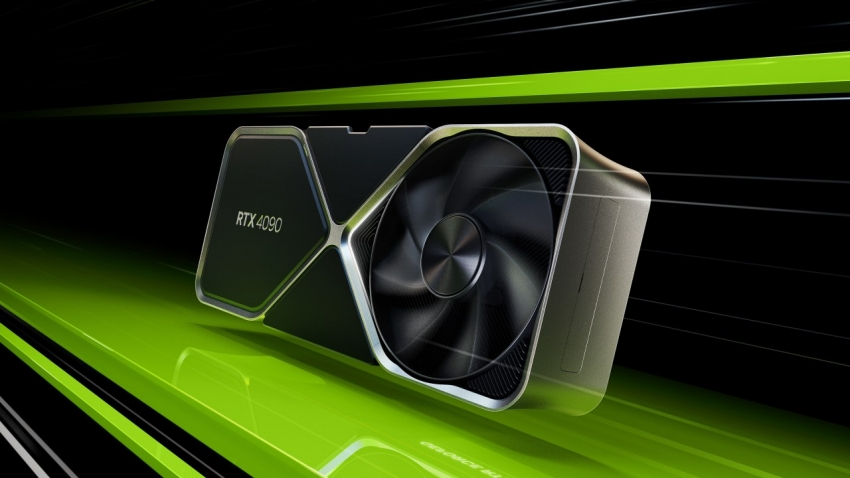

### Grafische kaart

De grafische kaart verwerkt visuele informatie en is essentieel voor gaming, videobewerking en andere grafisch-intensieve taken. Sommige computers hebben geïntegreerde GPU’s (in de CPU), terwijl anderen een aparte grafische kaart hebben voor betere prestaties.

#### Kan aparte kaart zijn of onboard
- **Dedicated grafische kaart**: Dit is een **losse videokaart** die in het moederbord wordt geplaatst via een PCIe-slot. Dit type kaart heeft eigen **VRAM (Video RAM)** en biedt veel kracht voor gaming, 3D-rendering en wetenschappelijke simulaties.
- **Onboard (geïntegreerde GPU)**: Sommige processoren hebben een ingebouwde GPU die direct gebruik maakt van het systeemgeheugen. Dit is energiezuiniger en goedkoper, maar minder krachtig dan een aparte kaart.

#### Geoptimaliseerd voor grafische doeleinden
De GPU is specifiek ontworpen om complexe **beeldverwerking** te versnellen. In tegenstelling tot de CPU, die algemene berekeningen uitvoert, is de GPU geoptimaliseerd om **parallelle berekeningen** uit te voeren, wat cruciaal is voor het verwerken van grote hoeveelheden grafische data.

#### Raytracing
Raytracing is een **geavanceerde techniek** die lichtstralen simuleert en realistische schaduwen, reflecties en belichting creëert. Moderne grafische kaarten, zoals NVIDIA’s RTX-serie en AMD’s RDNA2-chips, ondersteunen **hardwarematige raytracing**, wat zorgt voor een veel realistischer beeld in games en animaties.

#### Floating Point Operaties
GPU’s zijn gespecialiseerd in **floating-point berekeningen** (decimale berekeningen), wat cruciaal is voor grafische weergave, simulaties en wetenschappelijke toepassingen. Dit maakt ze efficiënter dan CPU’s in taken die enorme hoeveelheden numerieke berekeningen vereisen.

#### Ook bruikbaar om AI’s te trainen
Door de grote parallelle rekenkracht worden GPU’s vaak ingezet voor **AI-training** en **machine learning**. Ze kunnen enorme datasets verwerken en neurale netwerken veel sneller trainen dan traditionele CPU’s.
Populaire AI-training frameworks zoals **TensorFlow** en **PyTorch** ondersteunen GPU-versnelling om berekeningen te optimaliseren.
