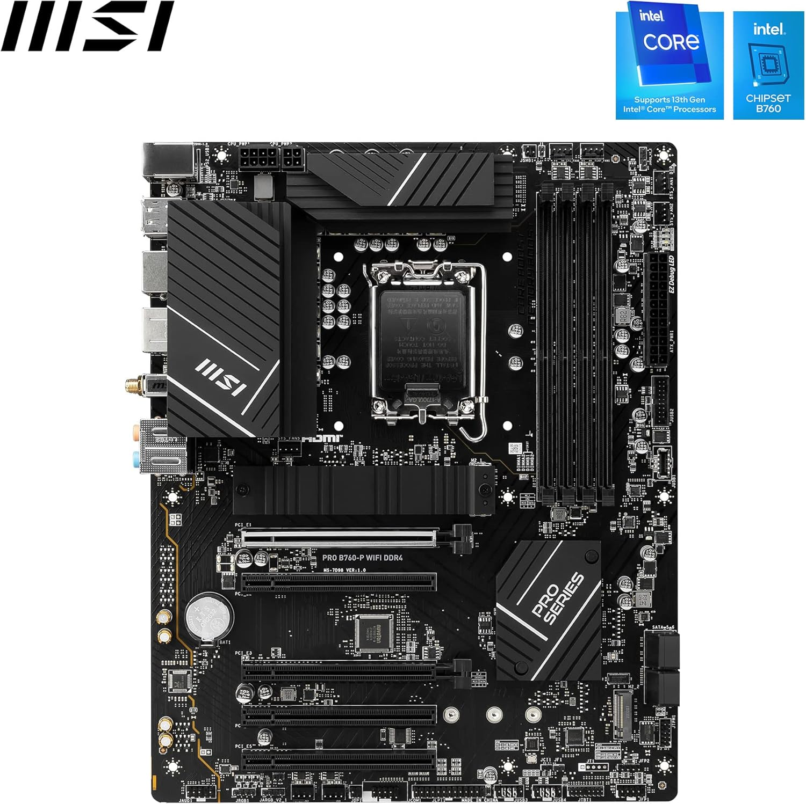
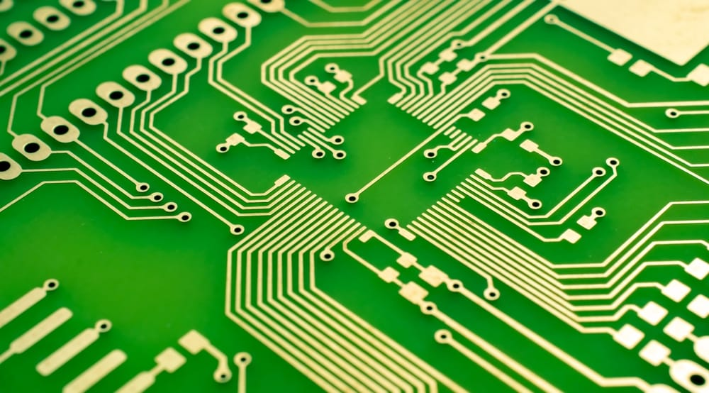
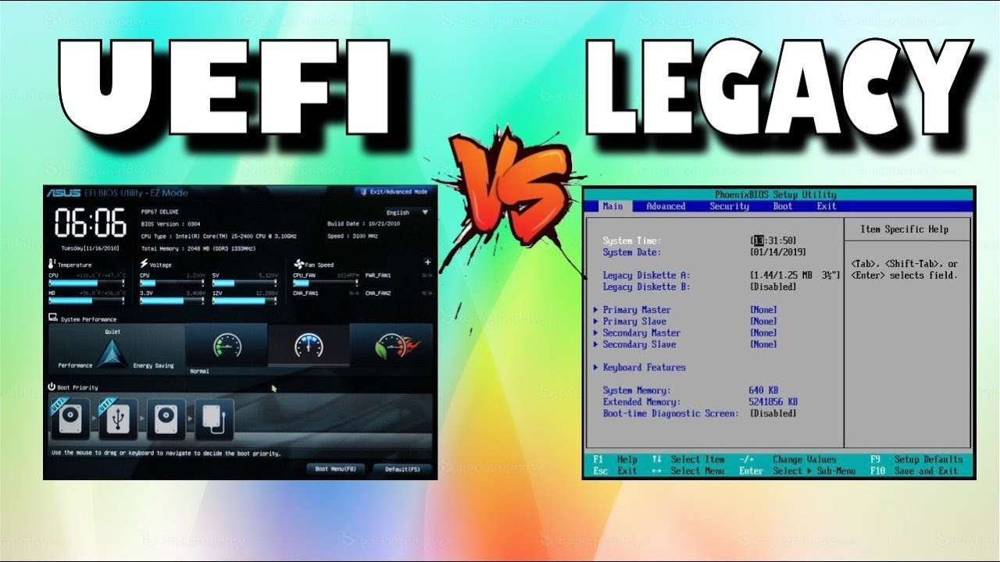
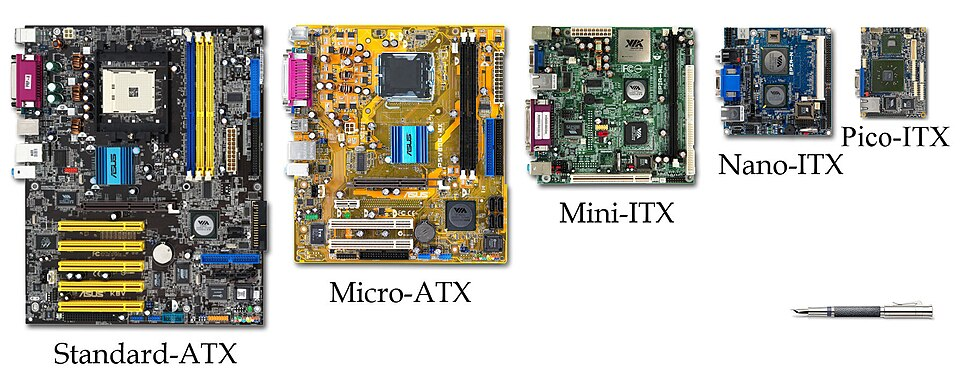

### Moederbord

Het moederbord is het centrale schakelpunt van de computer. Alle andere hardwarecomponenten worden hierop aangesloten. Het bevat belangrijke onderdelen zoals de chipset, aansluitingen voor de processor, geheugenmodules, uitbreidingskaarten en opslag.

#### Printed Circuit Board (PCB) met uitbreidingsmogelijkheden

Het moederbord is een **geprinte schakeling** (PCB) die alle componenten van een computer met elkaar verbindt. Moderne moederborden bevatten **uitbreidingsslots** zoals PCIe (Peripheral Component Interconnect Express), waarmee extra hardware kan worden toegevoegd, zoals grafische kaarten, geluidskaarten en netwerkkaarten.

Daarnaast heeft het moederbord **aansluitingen voor opslag** (SATA, NVMe), externe apparaten (USB, Thunderbolt) en RAM-slots voor geheugenuitbreiding. Sommige moederborden hebben ingebouwde Wi-Fi en Bluetooth modules, terwijl andere een aparte kaart vereisen.

#### Bevat ROM met Firmware
Het moederbord bevat **ROM-geheugen** (Read-Only Memory) waarin de firmware is opgeslagen. Dit is een klein stukje software dat de hardware initialiseert en zorgt voor de communicatie met het besturingssysteem.
- **Initialisatie van hardware**: Bij het opstarten controleert de firmware of alle componenten goed functioneren, zoals de processor, RAM en opslag.
- **Opstarten van het besturingssysteem**: De firmware zoekt naar een besturingssysteem op de harde schijf of SSD en start dit op.
- **BIOS of UEFI**:

    - **BIOS** (Basic Input/Output System) is een oudere firmware-versie die de computer initialiseert.
    - **UEFI** (Unified Extensible Firmware Interface) is de moderne vervanger van BIOS, met een grafische interface en ondersteuning voor grotere schijven en snellere opstartprocessen.

#### Verschillende formfactors

De grootte en indeling van een moederbord worden bepaald door de **formfactor**. Dit bepaalt welke behuizing en componenten compatibel zijn. Veelvoorkomende formfactors zijn:
- **ATX**: Standaardformaat voor desktops, met veel uitbreidingsmogelijkheden.
- **Micro ATX**: Compacte versie van ATX met iets minder uitbreidingsslots.
- **Mini ITX**: Klein formaat, geschikt voor compacte systemen en stille computers.
- **Nano ITX**: Nog kleiner, vaak gebruikt in embedded systemen.
- **Pico ITX**: Ultracompact, bedoeld voor gespecialiseerde toepassingen zoals industriële apparatuur.